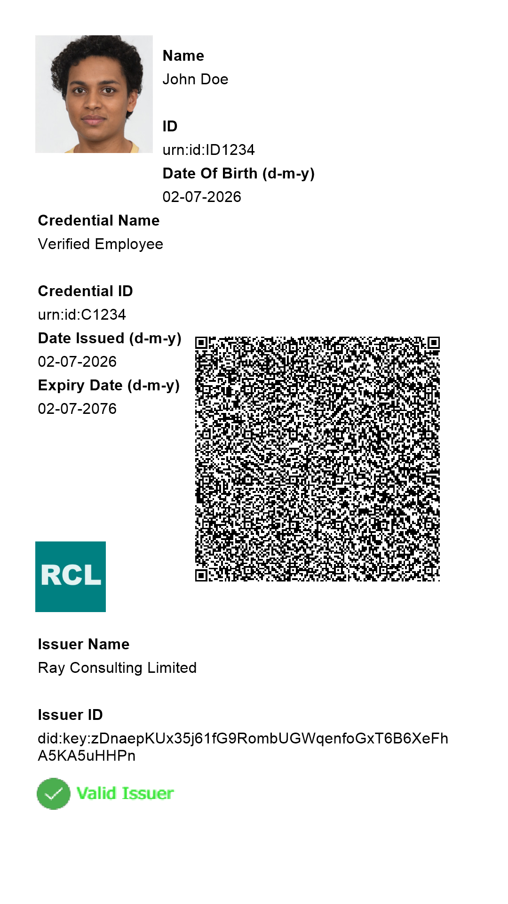
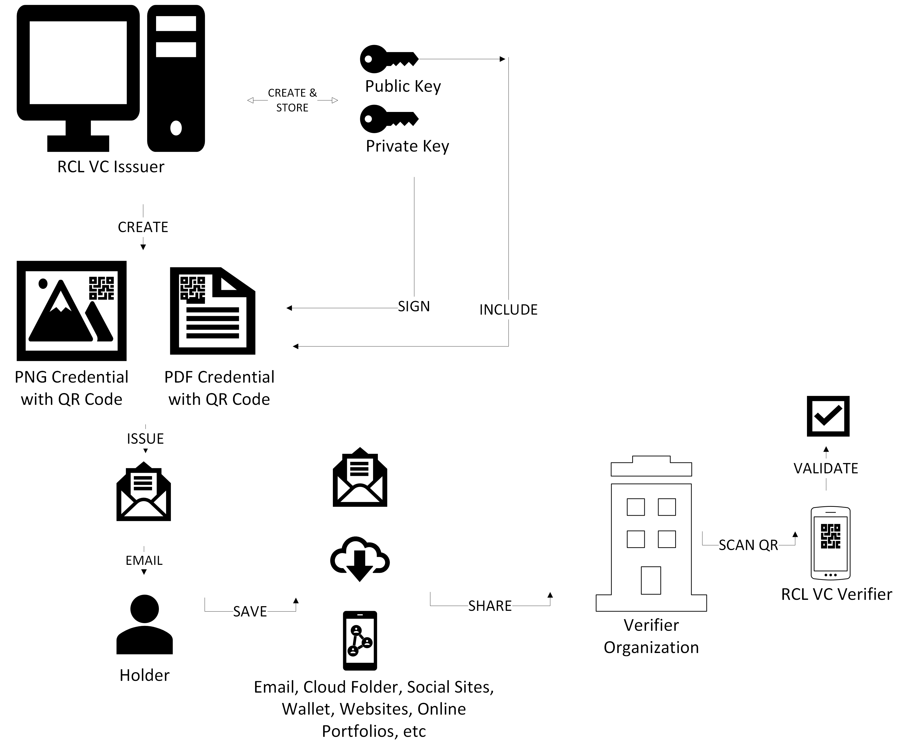

---
title: Introduction
description: RCL Verifiable Credential (VC) is a platform to issue, store and verify W3C Verifiable Credentials.
has_children: false
nav_order: 1
---

# Introduction
**V1.0**

**RCL Verifiable Credential (VC)** is a platform to issue, store and verify [W3C Verifiable Credentials](https://www.w3.org/TR/vc-overview/).

# What are Verifiable Credentials

Verifiable Credentials (VCs) are tamper-proof, cryptographically secure digital credentials that can be instantly checked and validated. Standardized by the World Wide Web Consortium (W3C), they act as the digital equivalent of physical documents like driver's licenses, academic diplomas, or passports. Unlike static PDF documents, VCs contain built-in cryptographic signatures that allow anyone to verify their authenticity automatically without needing a central database.

# The Triangle of Trust

The technology operates through an ecosystem containing three primary roles:

## Issuer
The authoritative entity (e.g., an organization, training institution or government agency) that creates the credential and digitally signs it using their private cryptographic key.

## Holder 
The recipient who receives the credential from an issuer and safely stores it  on a smartphone, computer or digital wallet.

## Verifier 
The third-party entity (e.g. an organization, employer or a bank) that reviews the holder's credential and uses the issuer's cryptographic public key to instantly check the credential's validity.

# RCL VC Platform

The RCL VC Platform comprises of the following applications:

## RCL VC Issuer

The RCL VC Issuer application is a Windows Desktop application. It can be downloaded and installed on a Windows PC for free from the Windows Store. It allows any organization to create and issue Verifiable Credentials to holders.

## RCL VC Verifier

The RCL VC Verifier application is a mobile Android/iOS application that can be downloaded and installed for free from the relevant mobile app store. The application is also available as a Windows Desktop application from the Windows Store. It allows any verifier to instantly verify a Verifiable Credential's validity.

## RCL VC Wallet

The RCL VC Wallet application is a mobile Android/iOS application that can be downloaded and installed for free from the relevant mobile app store. The application is also available as a Windows Desktop application from the Windows Store. It allows holders to store their Verifiable Credentials on a mobile device or a Windows PC.

# How It Works

## Issuance

An issuer will use the RCL VC Issuer application to create a cryptographic public-private key pair that they **solely control**. The keys are securely stored by the Windows OS on the issuer's private PC. 

### Credentials as a .PNG Image File

The issuer will then use the application to create a credential and sign it with their private key. The public key will be stored within the credential itself. The issuer will embed the credential data as **metadata** within a .PNG image file. In addition, a QR code will be placed on the image. The QR code also contains the credential data. The issuer will then use the application to send the credential to the holder via email.

``Sample Credential as a .PNG Image File``

## Recipient

The issuer will issue a credential to a holder via email. The credential will be included in the email as a file attachment.

### Credentials as a .PNG Image File

The holder will download and save their credential as an image file on their mobile device, PC or cloud storage (eg. Google Drive or Microsoft One Drive). The holder can also save their credentials on the RCL VC Wallet application. The holder can then share the image file with employers and others via email, share links to their cloud folders, social media, personal websites or online portfolios. 

## Verifier

Once a holder shares their credential files with a verifier, the verifier can use the RCL VC Verifier application to instantly check its validity. The verifier will use the application to scan the QR code and decode the data for the credential. The application will then extract the Issuer's public key contained in the credential to perform various security checks to verify the validity of the credential and ensure it was not tampered with.

``RCL VC Workflow``

